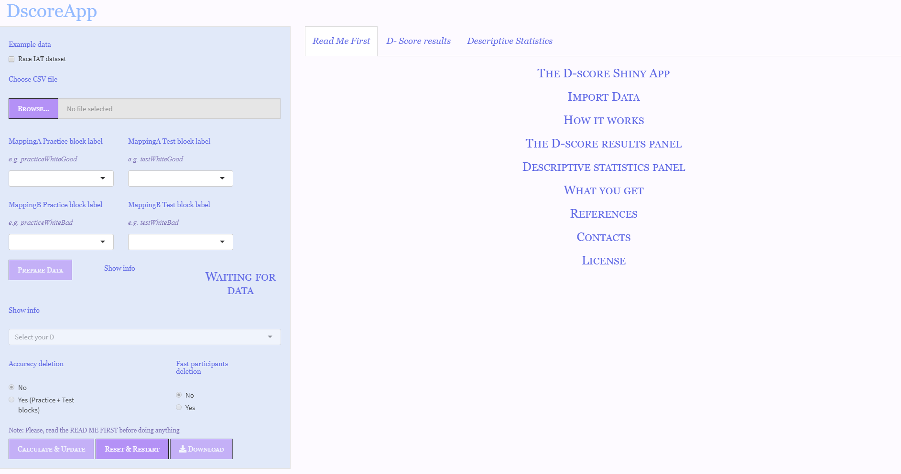

```{r setup, echo = FALSE, include = FALSE}
knitr::opts_chunk$set(echo = FALSE)

```


## The Implicit Association Test {.build .columns-2 .smaller}

<div  style="align="center;">
<h3 style="color:#cd82d1;"  font-weight: "bold"; text-align: center; > Coke-Good/Pepsi-Bad (CGPB)  </h3>
<br />

```{r, out.width="50%%", fig.align='center'}
knitr::include_graphics("C:/Users/huawei/Desktop/images/cocagood.png")
```

<!-- the columns should break here -->


<h3 text-align: center; style="color:#498f36;" font-weight: "bold";> Pepsi-Good/Coke-Bad (PGCB) </h3>

<br />
```{r, out.width="50%%", fig.align='center'}
knitr::include_graphics("C:/Users/huawei/Desktop/images/cocabad.png")
```

</div>


<div id="test1", style="align="center;">
<center>
<h3>IAT structure</h3>
<table style="width=640px">
<tr>
<th> Block</th>
<th> Function </th>
<th> Left response key </th>
<th> Right response key </th>
</tr>
<tr>
<td><em> B1 </em> </td>
<td>Practice</td>
<td>Coke</td>
<td>Pepsi</td>
</tr>
<tr>
<td><em> B2 </em></td>
<td>Practice</td>
<td>Good</td>
<td>Bad</td>
</tr>
<tr>
<td style="background-color: #e7d4e8; color: black;rm"><em> B3 </em></td>
<td style="background-color: #e7d4e8; color: black;">Associative practice Mapping A</td>
<td style="background-color: #e7d4e8; color: black;">Coke & Good</td>
<td style="background-color: #e7d4e8; color: black;">Pepsi & Bad </td>
</tr>
<tr>
<td style="background-color: #e7d4e8; color: black;"><em> B4 </em></td>
<td style="background-color: #e7d4e8; color: black;">Associative test Mapping A</td>
<td style="background-color: #e7d4e8; color: black;">Coke & Good</td>
<td style="background-color: #e7d4e8; color: black;">Pepsi & Bad </td>
</tr>
<tr>
<td><em> B5 </em></td>
<td>Practice</td>
<td>Pepsi</td>
<td>Coke</td>
</tr>
<tr>
<td style="background-color: #d9f0d3; color: black;"> <em> B6 </em></td>
<td style="background-color: #d9f0d3; color: black;">Associative practice Mapping B</td>
<td style="background-color: #d9f0d3; color: black;">Pepsi & Good</td>
<td style="background-color: #d9f0d3; color: black;">Coke & Bad</td>
</tr>
<tr>
<td style="background-color: #d9f0d3; color: black;"><em> B7 </em></td>
<td style="background-color: #d9f0d3; color: black;">Associative test Mapping B</td>
<td style="background-color: #d9f0d3; color: black;">Pepsi & Good</td>
<td style="background-color: #d9f0d3; color: black;">Coke & Bad</td>
</tr>
</table>
</center>
</div>


## The D-score {.build}
<div style="position: top:12%;">
<h4> D-score core procedure </h4>

$D_{practice} = \frac{M_{B6} - M_{B3}}{sd_{B6,B3}}$

$D_{test} = \frac{M_{B7} - M_{B4}}{sd_{B7,B4}}$
</div>

<div style="position: fixed; top:30%; right:35%">
$D_{score} = \frac{D_{practice} + D_{test}}{2}$
</div>

<div  style="position: fixed; bottom:22%;  left:42%;">
<h4> <em> D-score </em>algorithms </h4>

 <right>
                                 <table style= "font-size:16pt;">
                                 <tr>
                                 <th>Dscore</th>
                                 <th>Error inflation</th>
                                 <th>Lower tail treatment</th>
                                 </tr>
                                 <tr>
                                 <td>D1</td>
                                 <td>Built-in correction</td>
                                 <td>No</td>
                                 </tr>
                                 <tr>
                                 <td>D2</td>
                                 <td>Built-in correction</td>
                                 <td>delete trials &lt; 400 ms</td>
                                 </tr>
                                 <tr>
                                 <td>D3</td>
                                 <td>Replace errors: mean (correct responses) + 2sd</td>
                                 <td>No</td>
                                 </tr>
                                 <tr>
                                 <td>D4</td>
                                 <td>Replace errors: mean (correct responses) + 600 ms</td>
                                 <td>No</td>
                                 </tr>
                                 <tr>
                                 <td>D5</td>
                                 <td>Replace errors: mean (correct responses) + 2sd</td>
                                 <td>delete trials &lt; 400 ms</td>
                                 </tr>
                                 <tr>
                                 <td>D6</td>
                                 <td>Replace errors: mean (correct responses) + 600 ms</td>
                                 <td>delete trials &lt; 400 ms</td>
                                 </tr>
                                 </table>
                                 </right>
</div>

## Available options {.build}

<div>
<table> 
<tr>
<th> </th>
<th> Open source </th>
<th> Programming skills </th>
<th> Multiple Scores </th>
<th> Plot </th>
</tr>
<tr>
<td> SPSS </td>
<td> NO </td>
<td> YES </td>
<td> YES </td>
<td> NO </td>
</tr>
<tr>
<td> Inquisit </td>
<td> NO </td>
<td> NO </td>
<td> NO </td>
<td> NO </td>
</tr>
<tr>
<td style="font-family: Courier New,  Monospace;"> IATanalytics </td>
<td> YES </td>
<td> YES </td>
<td> Not clear </td>
<td> NO </td>
</tr>
<tr>
<td style="font-family: Courier New,  Monospace;"> IATScore </td>
<td> YES </td>
<td> YES </td>
<td> Not clear </td>
<td> NO </td>
</tr>
<tr>
<td style="font-family: Courier New,  Monospace;"> IAT </td>
<td> YES </td>
<td> YES </td>
<td> YES </td>
<td> YES </td>
</tr>
<tr>
<td style="font-family: Courier New,  Monospace;"> IATScores </td>
<td> YES </td>
<td> YES </td>
<td> YES </td>
<td> YES </td>
</tr>
<tr>
<td style="font-family: Courier New,  Monospace;"> implicitMeasures </td>
<td> YES </td>
<td> YES </td>
<td> YES </td>
<td> YES </td>
</tr>
</table>
</div>

<div style="position: fixed; bottom: 18%; left: 20%;">
<table style="width:900px; border:0;">
<tr>
<td style="width:15%; border:none;">
```{r, out.width="75%%"}
knitr::include_graphics("C:/Users/huawei/Desktop/images/emoji.png")
```
</td>
<td style="text-align:left; border:none; font-size:30px"> Something Open Source, easy and intuitive to use, able to compute multiple scores, and to provide nice graphical representations </td>
</tr>
</table>
</div>


## Shiny has the answer: DscoreApp

<center>
<a href="http://fisppa.psy.unipd.it/DscoreApp/">
         
      </a>
</center>

<!-- <iframe width="720" height="480" src="C:/Users/huawei/Desktop/images/zoom_0.mp4" type="video/mp4" align="middle" frameborder="0" allowfullscreen></iframe> -->

<!-- <iframe width="720" height="480" src="C:/Users/huawei/Desktop/images/DscoreDemo.mp4" type="video/mp4" align="middle" frameborder="0" allowfullscreen></iframe>  -->


## 

<h2 style="position: fixed; top:30%; left: 43%;">
Thanks!
</h2>

<div style="position: fixed; bottom: 22%; left: 33%;">
<table style="width:600px; border:0;">
<tr>
<td style="width:15%; border:none;">
```{r, out.width="45%%"}

```
</td>
<td style="text-align:left; border:none;"> http://fisppa.psy.unipd.it/DscoreApp/ </td>
</tr>
<tr>
<td style="border:none;"> 
```{r, out.width="45%%"}
knitr::include_graphics("C:/Users/huawei/Desktop/images/download.png")
```
</td>
<td style="text-align:left; border:none;"> otta.epifania@gmail.com </td>
</tr>
<tr>
<td style="border:none;"> 
```{r, out.width="45%%"}
knitr::include_graphics("C:/Users/huawei/Desktop/images/github.png")
```
</td>
<td style="text-align:left; border:none;"> <a href="https://github.com/OttaviaE"> @OttaviaE</a>  </td>
</tr>
<tr>
<td style="border:none;">
```{r, out.width="45%%"}
knitr::include_graphics("C:/Users/huawei/Desktop/images/twitter.png")
```
</td>
<td style="text-align:left; border:none;"> <a href="https://twitter.com/ExeOttavia"> @ExeOttavia</a> </td>
</tr>
<tr>
<td style="border:none;">
```{r, out.width="35%%"}
knitr::include_graphics("C:/Users/huawei/Desktop/images/linkedin.png")
```
</td>
<td style="text-align:left; border:none;"> <a href="https://www.linkedin.com/in/ottavia-epifania-612ba9b3/"> @OttaviaEpifania</a> </td>
</tr>
</table>
</div>

<div style="position: fixed; bottom: 13%; right: 20%;">
```{r, out.width="75%%"}

```
</div>